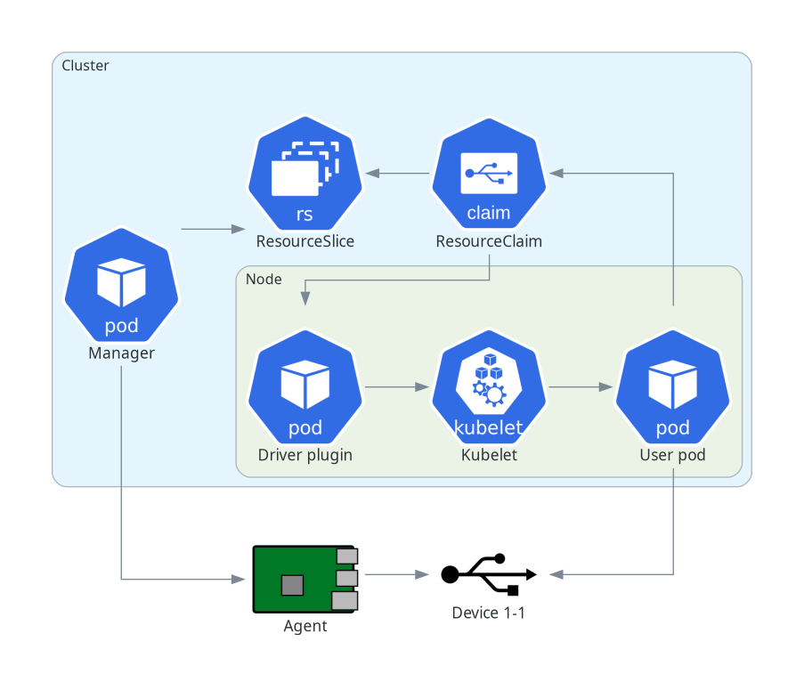

# dra-usbip-driver

Kubernetes DRA driver for accessing USB devices
outside of the cluster via USB/IP.

Source          | <https://github.com/DiamondLightSource/dra-usbip-driver>
:---:           | :---:
Documentation   | <https://DiamondLightSource.github.io/dra-usbip-driver>
Releases        | <https://github.com/DiamondLightSource/dra-usbip-driver/releases>

## Architecture

Unlike a typical device driver where devices are
locally available on a Node and everything can
be handled by a single plugin DaemonSet, this
driver is split into three components:

* An **Agent** component that runs on a machine
  (for example a Raspberry Pi) outside the cluster,
  exposing attributes of USB devices connected to it.
* A **Manager** component that runs as one pod
  in the cluster, fetching data from one or more
  Agents and creating ResourceSlice objects in
  the cluster to represent the USB devices.
* The **Plugin** component, DaemonSet pods that
  handle requests from the Kubelet to prepare
  resource claims for pods, by attaching remote
  devices with USB/IP and telling the Kubelet
  how to mount the device to the pod.

<!-- README only content. Anything below this line won't be included in index.md -->

See <https://DiamondLightSource.github.io/dra-usbip-driver> for full documentation.
